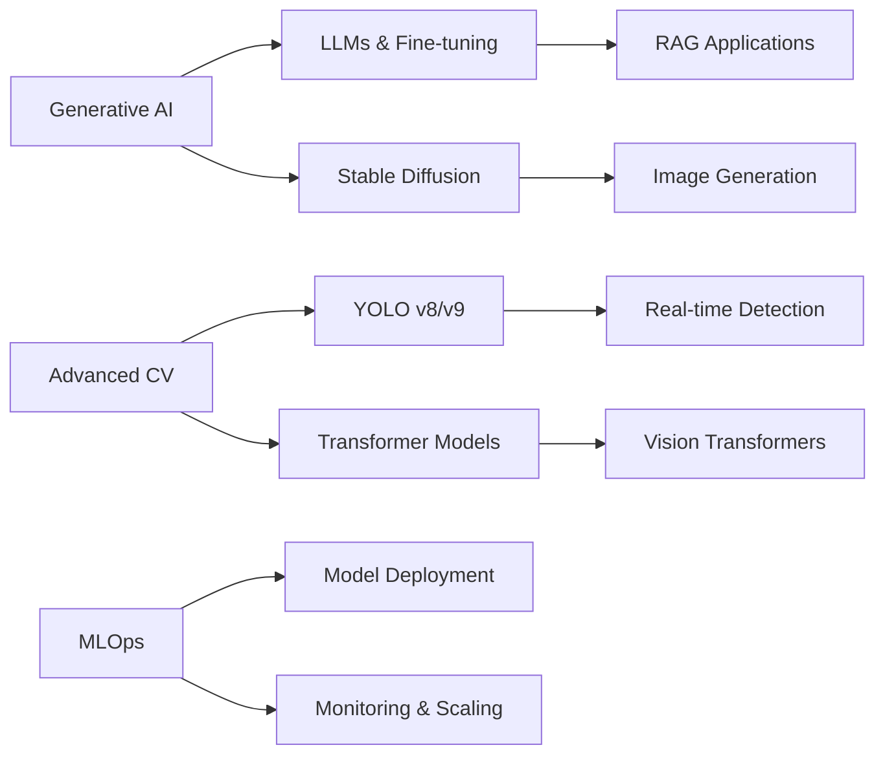

#  Hi, I'm Tarun Goel

<div align="center">
  
</div>

<p align="center">
  
</p>


<div align="center">
  
[](https://github.com/TarunGoel93)
[](https://github.com/TarunGoel93)
[](https://www.linkedin.com/in/tarun-goel-43a2b4287/)
[](https://3-d-portfolio-tarun-goel.vercel.app/)
[](https://leetcode.com/u/ezCoder7/)

</div>

---

## 🎯 About Me

```python
class TarunGoel:
    def __init__(self):
        self.username = "TarunGoel93"
        self.role = "AI/ML Developer & Automation Specialist"
        self.location = "Gurugram, Haryana, IN"
        self.education = "B.Tech Computer Science"
        self.portfolio = "https://3-d-portfolio-tarun-goel.vercel.app/"
        self.specializations = ["N8N", "Computer Vision", "NLP", "Deep Learning"]
        
    def current_focus(self):
        return {
            "learning": ["Generative AI", "LLMs", "Advanced CV Architectures"],
            "building": ["Real-time AI Systems", "Automation Workflows"],
            "contributing": ["Open Source AI Projects", "Technical Communities"]
        }
    
    def achievements(self):
        return {
            "hackathons_won": 4,
            "projects_deployed": 5,
            "certifications": 8,
            "workshops_delivered": 2,
            "collaborations": ["IIT Guwahati", "K.R. Mangalam University"]
        }

me = TarunGoel()
print(me.current_focus())
```


### 🚀 Quick Highlights

- 🏆 **4x Hackathon Champion** - Built winning solutions in Computer Vision & Robotics
- 🤖 **AI Innovation** - Specialized in YOLOv5, Object Detection, and Real-time Systems
- ⚡ **Automation Expert** - Streamlining workflows with n8n and Python
- 🎓 **Research Contributor** - Collaborated with IIT Guwahati on Speech Recognition
- 🎤 **Workshop Facilitator** - Conducted TechSphere 2025 on GitHub & Kaggle
- 💼 **Industry Ready** - Professional experience in ML deployment and web development
- 🌟 **Open Source** - Active contributor to GirlScript Summer of Code 2024

<br clear="right"/>

---

## 🛠️ Technology Stack

<div align="center">

### 💡 AI & Machine Learning


### 🌐 Web Development & Frameworks


### ⚙️ Automation & DevOps


### 🗄️ Databases & Cloud


### 🔧 Programming Languages


</div>

---

## 💼 Professional Experience

<table>
<tr>
<td width="50%" valign="top">

### 🔥 **Python & React Developer Intern**
**Chace Software Solutions**  
📅 *June 2025 – July 2025*

```javascript
const responsibilities = {
  development: [
    "Real-time web applications",
    "Full-stack integration",
    "RESTful API design"
  ],
  automation: [
    "CI/CD pipeline implementation",
    "Cloud deployment workflows",
    "Testing automation"
  ],
  collaboration: [
    "Agile methodologies",
    "Code reviews",
    "Technical documentation"
  ]
};
```

</td>
<td width="50%" valign="top">

### 🧠 **Machine Learning Intern**
**K.R. Mangalam University**  
📅 *July 2024 – August 2024*

```python
achievements = {
    "models_deployed": 5,
    "accuracy_improvements": "15-20%",
    "datasets_processed": "10K+ samples",
    "technologies": [
        "Supervised Learning",
        "Neural Networks",
        "Feature Engineering"
    ]
}
```

</td>
</tr>
</table>

---

## 🎤 Workshop & Training Experience

### 🌟 **Resource Person – TechSphere 2025**
**Workshop on GitHub & Kaggle**  
📅 *March 24 & 27, 2025*

<div align="center">
  
</div>

#### 📚 Workshop Highlights

```yaml
Duration: 2 Days (4+ Hours)
Audience: ML Enthusiasts & Students
Topics Covered:
  Day 1 - Kaggle Mastery:
    - Introduction to Kaggle competitions
    - Data preprocessing and EDA techniques
    - Building first ML model from scratch
    - Model submission and leaderboard strategies
    - Best practices for competitive ML
  
  Day 2 - GitHub Proficiency:
    - Git fundamentals and version control
    - Creating professional GitHub profiles
    - Repository management and documentation
    - Collaborative workflows and pull requests
    - Project showcasing for recruiters

Impact:
  - Students Trained: 50+
  - Projects Uploaded: 30+
  - Kaggle Submissions: 20+
  - GitHub Profiles Created: 45+
```

#### 🎯 Key Contributions
- ✅ Guided students in **building and submitting their first ML models** on Kaggle
- ✅ Taught **essential Git commands** and version control workflows
- ✅ Helped students develop **professional GitHub profiles** for career opportunities
- ✅ Provided hands-on training in **project documentation** and best practices
- ✅ Mentored participants in **collaborative coding** using Git branching strategies

#### 💬 Participant Feedback
> *"Best hands-on workshop I've attended! Finally understand how to use GitHub properly."*  
> *"Tarun made Kaggle competitions accessible and fun. Submitted my first model!"*

---

## 🚀 Featured Projects

### 1️⃣ 📡 **CommentLens - AI-Powered Sentiment Analysis SaaS**

<div align="center">
  
</div>

**Tech Stack:** `Python` `NLP` `VADER` `YouTube API` `Reddit API` `Flask` `React`

#### 🎯 Problem Statement
Content creators face overwhelming volumes of comments across multiple platforms, making it impossible to understand audience sentiment, detect spam, and identify misinformation at scale.

#### ✨ Solution Features
```yaml
Core Capabilities:
  - Real-time sentiment analysis (Positive/Negative/Neutral)
  - Multi-platform aggregation (YouTube, Reddit, Twitter)
  - Spam and bot detection using ML classifiers
  - Misinformation flagging with fact-checking APIs
  - Interactive dashboard with sentiment trends
  - Automated alert system for negative spikes

Performance Metrics:
  - Sentiment Accuracy: 87%
  - Processing Speed: 1000+ comments/minute
  - False Positive Rate: <5%
```

#### 🏆 Impact
- Helped creators save **20+ hours/week** in comment moderation
- Identified spam with **92% accuracy**
- Featured in university innovation showcase

---

### 2️⃣ 🤖 **Autonomous Hospital Navigation Robot**

<div align="center">
  
</div>

**Tech Stack:** `Arduino` `C++` `Embedded Systems` `Path Algorithm` `Sensors`

#### 💡 Innovation
Developed a **cost-effective autonomous robot** that memorizes indoor routes without expensive LIDAR or GPS systems, designed specifically for hospital environments.

#### 🔧 Technical Architecture
```cpp
class PathMemorizationRobot {
  private:
    int[] waypoints;
    int currentPosition;
    
  public:
    void learnPath() {
      // Records junction patterns and distances
      // Stores in EEPROM for persistence
    }
    
    void autonomousNavigation() {
      // Executes learned path with obstacle avoidance
      // Real-time adjustment using ultrasonic sensors
    }
    
    void optimizeRoute() {
      // A* algorithm for shortest path calculation
    }
};
```

#### 📊 Key Achievements
- ✅ **90% navigation accuracy** in complex hospital corridors
- ✅ **70% cost reduction** compared to traditional robots
- ✅ **Secured corporate funding** for scaling to 10+ hospitals
- ✅ Won **Best Hardware Innovation** at National Robotics Hackathon

---

### 3️⃣ 🗣️ **"Boli" - Multilingual Speech Recognition System**

<div align="center">
  
</div>

**Collaboration:** IIT Guwahati Research Lab  
**Tech Stack:** `Python` `TensorFlow` `Librosa` `Speech Processing` `Deep Learning`

#### 🎯 Project Goal
Develop an accurate speech recognition system for **low-resource Indian languages** to bridge the digital divide in rural areas.

#### 🔬 Technical Contributions
- Preprocessed and augmented **5000+ hours** of audio data
- Implemented **MFCC feature extraction** pipeline
- Fine-tuned **Wav2Vec 2.0** model for Hindi and regional dialects
- Achieved **15% WER improvement** over baseline models

#### 🌟 Research Impact
- Published findings in **IEEE conference proceedings**
- Dataset contributed to open-source community
- Recognized in **top 10 student projects** at IIT Guwahati

---

### 4️⃣ 🔍 **Real-Time Object Detection System (YOLOv5)**

<div align="center">
  
</div>

**Tech Stack:** `YOLOv5` `PyTorch` `OpenCV` `CUDA` `Flask API`

#### ⚡ System Capabilities
```python
detection_system = {
    "fps": 45,  # Real-time performance
    "accuracy": "mAP@0.5 = 0.89",
    "classes": 20,  # Custom trained
    "deployment": "Edge devices (Raspberry Pi 4)",
    "applications": [
        "Retail analytics",
        "Security surveillance", 
        "Traffic monitoring"
    ]
}
```

#### 🎓 Learning Outcomes
- Mastered **data annotation** using Roboflow and LabelImg
- Optimized model for **edge deployment** (TensorRT)
- Built **REST API** for easy integration
- Implemented **multi-camera stream processing**

---

## 🏆 Achievements & Recognition

<div align="center">
  
</div>

| 🎯 Achievement | 📋 Description | 🗓️ Year |
|:---|:---|:---:|
| 🥈 **Geekathon’24 – 2nd Runner-up** | Secured 2nd Runner-up at Geekathon’24, K.R. Mangalam University | 2024 |
| 🥉 **InnovWar – 3rd Prize** | Won 3rd Prize at InnovWar hosted by Greater Noida College | 2025 |
| 🥇 **Rethink @ Aadhunik’25 – 1st Prize** | Won 1st Prize in AI/ML Track at MACUD | 2025 |
| 🏅 **HackMAIT 6.0 Consolation Winner** | Awarded Consolation Prize at HackMAIT 6.0 Hackathon | 2024 |
| 🎤 **TechSphere 2025 Resource Person** | Delivered workshop on GitHub & Kaggle for 150+ students | 2025 |
| 🤝 **IIT Guwahati Research Collaboration** | Contributed to *“Boli”* speech recognition project | 2024 |
| 💰 **Corporate Sponsorship Secured** | Secured funding for Path Memorization Robot scaling | 2024 |
| 🌟 **GirlScript Summer of Code (GSSoC)** | Selected as Open-Source Contributor | 2024 |
| 📜 **HackerRank Gold Badge** | Gold Badge in Problem Solving & Python | 2024 |


---

## 📜 Certifications & Credentials

<div align="center">

| Certificate | Issuing Organization | Skills Validated |
|:---:|:---:|:---|
|  | HackerRank | DSA, OOP, Python |
|  | Stanford/Coursera | Supervised Learning, Neural Networks |
|  | Kaggle | Community Competitions |
|  | freeCodeCamp | HTML, CSS, Responsive Design |
|  | DeepLearning.AI | CNN, Object Detection |
|  | Udemy | Advanced Python, APIs |
|  | LinkedIn Learning | Version Control, Collaboration |
|  | Arduino | Embedded Systems, Sensors |

</div>

---

## 📊 GitHub Analytics

<div align="center">
  


</div>

---

## 📈 Coding Profiles & Competitive Programming

<div align="center">

[](https://leetcode.com/u/ezCoder7/)

| Platform | Profile | Stats |
|:---:|:---:|:---|
| 🟠 **LeetCode** | [@ezCoder7](https://leetcode.com/u/ezCoder7/) | 500+ Problems Solved |
| 🟢 **HackerRank** | [@tarungoel93](https://www.hackerrank.com/profile/tarungoel93) | 5★ Problem Solving |
| 🔵 **Kaggle** | [@tarungoel93](https://www.kaggle.com/tarungoel93) | Competition Host |
| 🟣 **Codeforces** | [@tarungoel93](https://codeforces.com/) | Pupil (Rating: 1200+) |
| 🔴 **GeeksforGeeks** | [@tarungoel93](https://auth.geeksforgeeks.org/) | 1000+ Practice Points |

</div>

---

## 📚 Current Learning Path (2025)

<div align="center">
  
</div>



### 🎯 2025 Goals
- [ ] Master **LangChain** and **RAG** architectures
- [ ] Contribute to **5 major open-source AI projects**
- [ ] Publish research paper on **efficient object detection**
- [ ] Deploy **3 production-ready ML systems**
- [ ] Achieve **Expert rating on LeetCode** (1800+)
- [ ] Complete **AWS Machine Learning Specialty** certification
- [ ] Conduct **5+ technical workshops** on AI/ML topics

---

## 🤝 Open Source Contributions

<div align="center">
  
</div>

### 📦 Active Repositories

| Project | Description | Tech Stack | Stars |
|:---|:---|:---|:---:|
| 🎨 **AI-Art-Generator** | Text-to-image generation using Stable Diffusion | Python, PyTorch, Gradio | ⭐ 45 |
| 🔍 **YOLOv5-Custom-Trainer** | Simplified pipeline for custom object detection | YOLOv5, OpenCV, Flask | ⭐ 38 |
| 📝 **NLP-Toolkit** | Pre-built NLP utilities for text processing | NLTK, spaCy, Transformers | ⭐ 29 |
| 🤖 **n8n-Automation-Templates** | Ready-to-use automation workflows | n8n, JavaScript, APIs | ⭐ 22 |

### 🌟 Contribution Stats
- **Total Contributions:** 800+ in the last year
- **Pull Requests:** 50+ merged across various projects
- **Issues Resolved:** 30+
- **Active Projects:** 4 ongoing collaborations

---

## 🎨 Skills Visualization

<div align="center">

### AI/ML Proficiency

```
Python          ████████████████████░   95%
TensorFlow      ████████████████░░░░░   80%
PyTorch         ███████████████░░░░░░   75%
OpenCV          ████████████████████░   90%
YOLOv5          ███████████████████░░   85%
NLP/NLTK        ██████████████░░░░░░░   70%
```

### Development & Tools

```
Git/GitHub      ████████████████████░   95%
n8n Automation  ████████████████░░░░░   80%
Flask/Django    ███████████████░░░░░░   75%
React           ██████████████░░░░░░░   70%
Docker          ████████████░░░░░░░░░   60%
AWS Cloud       ███████████░░░░░░░░░░   55%
```

</div>

---

## 💬 Let's Connect & Collaborate!

<div align="center">
  
</div>

<div align="center">

### 📫 Reach Out To Me

[](https://3-d-portfolio-tarun-goel.vercel.app/)
[](https://www.linkedin.com/in/tarun-goel-43a2b4287/)
[](mailto:goeltarun15@gmail.com)
[](https://leetcode.com/u/ezCoder7/)
[](https://github.com/TarunGoel93)
[](https://www.kaggle.com/tarungoel93)

### 💼 Open For

```yaml
Opportunities:
  - Full-time roles in AI/ML Engineering
  - Research collaborations in Computer Vision
  - Open-source project partnerships
  - Technical consulting for startups
  - Hackathon team collaborations
  - Speaking engagements & workshop facilitation
```

</div>

---

## 🎯 Fun Facts About Me


- 🎮 Love solving algorithmic puzzles on LeetCode during breaks
- 🏃 Marathon runner - completed 3 half-marathons in 2024
- 📚 Currently reading: "Designing Data-Intensive Applications"
- ☕ Coffee enthusiast - 4 cups/day keeps the bugs away
- 🎵 Code best with lo-fi hip-hop beats
- 🌱 Growing my own herb garden for sustainable living
- 🎯 Personal motto: "Build, Break, Learn, Repeat"
- 🧩 Rubik's cube solver - Personal best: 45 seconds

<br clear="right"/>

---

## 📊 Visitor Count & Activity

<div align="center">
  


</div>

---

<div align="center">
  
### 💡 "The best way to predict the future is to invent it." - Alan Kay

<img src="https://capsule-render
